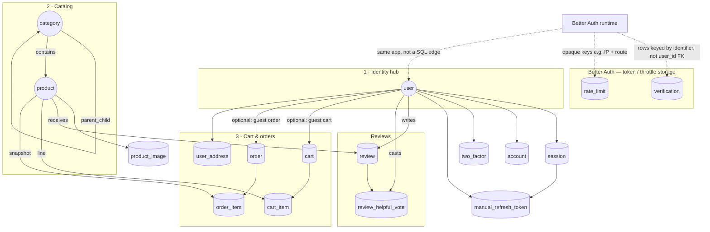
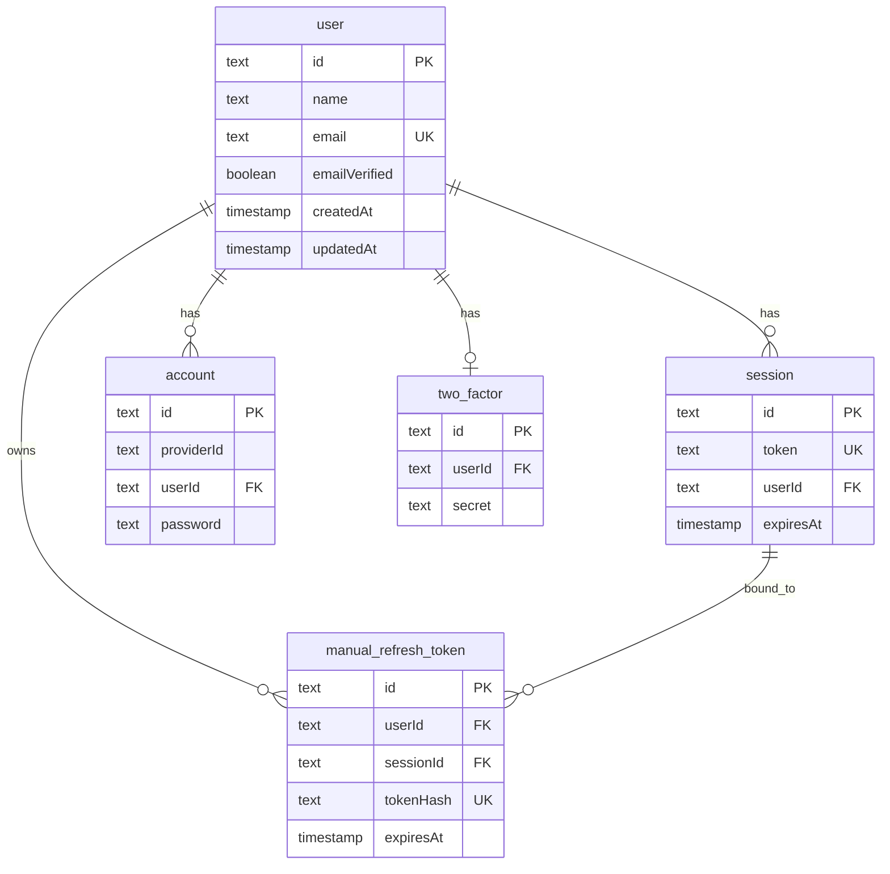
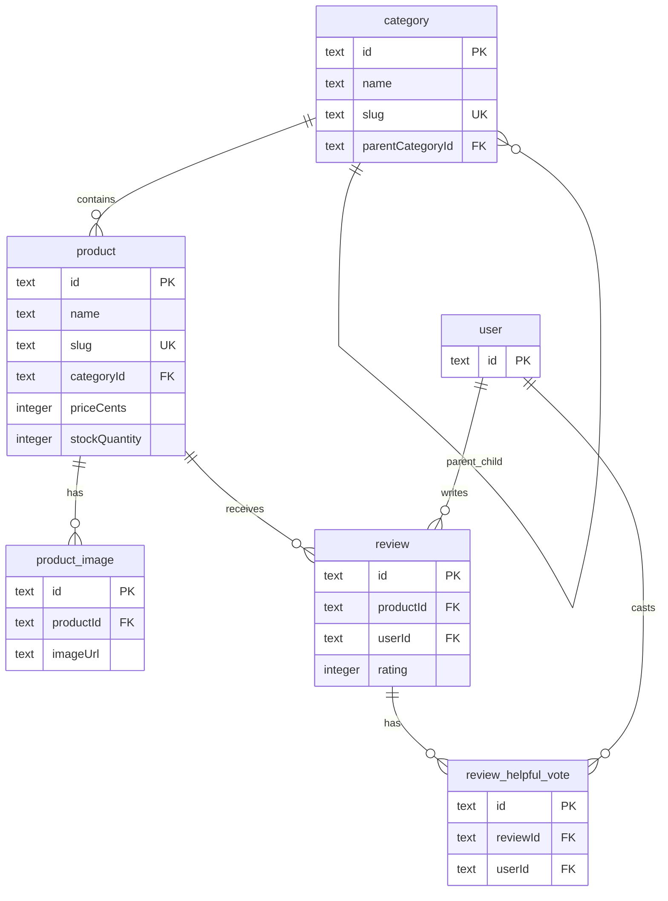
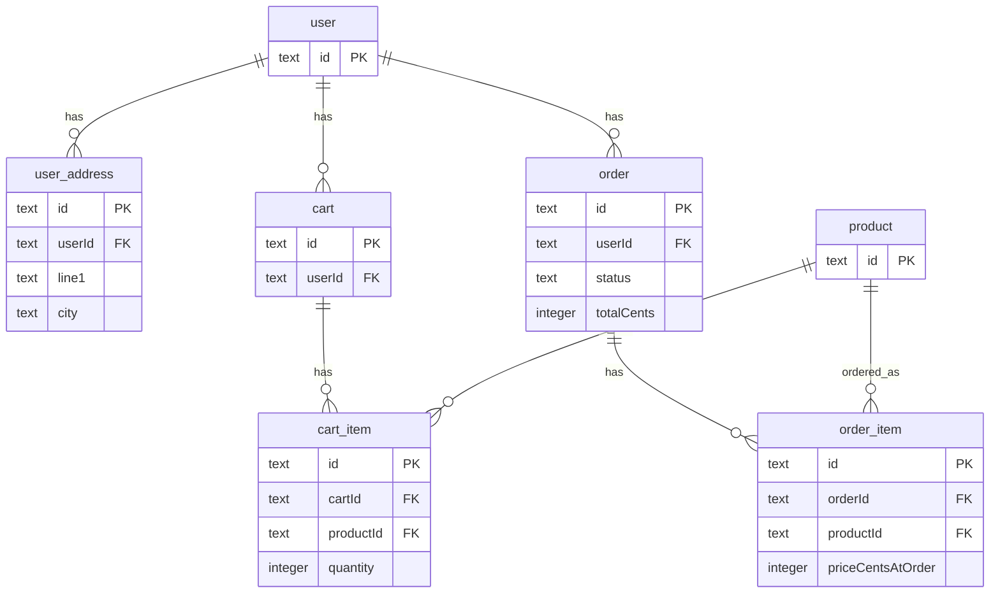

# Darkloom — B2C E-Commerce Platform

## Project Overview

**Darkloom** (codename tshirtshop) is a Business-to-Consumer (B2C) e-commerce platform built as a modular monolith. It provides secure user accounts, a structured product catalog, shopping cart, checkout with Stripe payments, order management, and an admin dashboard.

The platform is organized into three interconnected projects:

- **Project 1 (Foundation)** — User authentication, PostgreSQL database, product catalog with search and browse
- **Project 2 (Commerce)** — Cart, checkout, Stripe payments, order lifecycle
- **Project 3 (Experience)** — Customer-facing UI, admin dashboards, security and performance features

| Layer | Technologies |
|-------|--------------|
| **Monorepo** | Turborepo, npm workspaces, TypeScript |
| **Backend** | NestJS, PostgreSQL, Drizzle ORM, better-auth |
| **Frontend** | Next.js (App Router), React, Tailwind CSS, shadcn/ui |

---

## Entity Relationship Diagram

The database follows ACID rules. ERD pieces: **entities**, **attributes**, **relationships**, **PKs**, **FKs**, **cardinality**, **modality**.

**How to read this:** start with the **conceptual map** (where data flows), then use the three **domain diagrams** for column-level detail. A **full single diagram** is in [docs/ERD.md](docs/ERD.md).

### Conceptual map — where everything connects

Solid lines = foreign keys in PostgreSQL. Dotted lines = tables Better Auth uses **without** a `user_id` FK.



### Domain 1 — Login, sessions, refresh tokens (SQL FKs only)



*`verification` and `rate_limit`* live in the conceptual map: **no FK to `user`**. Better Auth matches `verification.identifier` to a user in application code.

### Domain 2 — Categories, products, images, reviews



### Domain 3 — Addresses, cart, checkout, orders



| Schema | Tables | Purpose |
|--------|--------|---------|
| **Auth** | user, session, account, verification, two_factor, rate_limit, manual_refresh_token | User accounts, OAuth, 2FA, rate limiting, refresh tokens |
| **Catalog** | category, product, product_image | Categories, products, images |
| **Address** | user_address | Saved shipping/billing addresses |
| **Cart** | cart, cart_item | Guest and user carts |
| **Order** | order, order_item | Orders, line items |
| **Review** | review, review_helpful_vote | Product reviews, helpful votes |

**Full ERD:** [docs/ERD.md](docs/ERD.md) — relationships, cardinality, modality, future tables.

---

## Setup and Installation Instructions

### Prerequisites

- **Node.js** 18+
- **PostgreSQL** 14+ (local or Docker)
- **npm** 11+

### Step 1 — Clone and Install

```bash
git clone <repository-url>
cd ecommerence/ecom/tshirtshop
npm install
```

### Step 2 — Environment Variables

Create `apps/backend/.env` (copy from `apps/backend/.env.example`):

| Variable | Required | Purpose |
|----------|----------|---------|
| `DATABASE_URL` | Yes | PostgreSQL connection string |
| `BETTER_AUTH_SECRET` | Yes | Cookie/token signing |
| `ENCRYPTION_KEY` | Yes | 64-char hex for PII encryption |
| `BLIND_INDEX_SECRET` | Yes | Email lookup (user creation) |
| `RESEND_API_KEY` | For email | Verification, password reset |
| `STRIPE_SECRET_KEY` | For payments | Stripe test key |
| `STRIPE_WEBHOOK_SECRET` | For webhooks | Stripe webhook secret |

Generate secrets:

```bash
node -e "console.log(require('crypto').randomBytes(32).toString('hex'))"
```

Create `apps/web/.env.local` with `API_URL` pointing to the backend (e.g. `http://localhost:3000`).

### Step 3 — Database

```bash
cd apps/backend
npm run db:push    # Apply schema
npm run db:seed    # Populate products and categories
```

### Step 4 — Run the Application

```bash
cd ecom/tshirtshop
npm run dev
```

- **Frontend:** http://localhost:3001  
- **Backend API:** http://localhost:3000  

### Build

```bash
cd ecom/tshirtshop
npm run build
```

### Run Tests

```bash
cd ecom/tshirtshop/apps/backend
npm test
```

---

## Usage Guide

### Customer Flow

1. **Browse** — View products by category, use faceted search (brand, price), sort by relevance/price/rating
2. **Search** — Type in search bar for dynamic suggestions
3. **Cart** — Add items (guest or logged-in). Cart persists across sessions for users
4. **Checkout** — Enter shipping address, apply coupon (e.g. `FRESHP100`), complete payment via Stripe
5. **Orders** — View order history, cancel pending orders, reorder

### Account Management

- **Register** — Email/password or OAuth (Google, Facebook). CAPTCHA on sign-up
- **Verify email** — Check inbox for verification link before first sign-in
- **Login** — JWT with access/refresh tokens. Optional 2FA (TOTP)
- **Password reset** — Request reset link via email

### Admin Dashboard

- **Products** — CRUD, bulk upload, archive
- **Orders** — View, update status, refund
- **Users** — List, ban, impersonate (admin plugin)
- **Reviews** — Moderate

Access admin at `/admin` (requires admin role).

---

## Additional Features and Bonus Functionality

| Feature | Description |
|---------|-------------|
| **Stripe payments** | Checkout Session, webhooks, refunds |
| **Two-factor authentication** | TOTP (Google Authenticator), backup codes |
| **Product reviews** | Ratings, helpful votes, aggregation |
| **Guest checkout** | Checkout without account |
| **Coupon codes** | e.g. FRESHP100 for free shipping |
| **Encryption at rest** | PII (addresses, email) encrypted in DB |
| **Local HTTPS** | Self-signed certs for dev ([docs/LOCAL-HTTPS-SETUP.md](docs/LOCAL-HTTPS-SETUP.md)) |

---

## Project Structure

```
ecommerence/
├── docs/                    # Documentation
│   ├── START-HERE.md        # Developer entry point
│   ├── ERD.md               # Entity relationship diagram
│   ├── 01-REQUIREMENTS/
│   ├── 03-ARCHITECTURE/
│   ├── 04-TASKS/
│   └── 07-DEVOPS/
└── ecom/tshirtshop/         # Monorepo root
    ├── apps/
    │   ├── backend/         # NestJS API (port 3000)
    │   └── web/             # Next.js storefront (port 3001)
    └── packages/
        ├── eslint-config/
        └── typescript-config/
```

---

## Documentation

| Document | Purpose |
|----------|---------|
| [START-HERE.md](docs/START-HERE.md) | Developer entry point, architecture, rules |
| [ERD.md](docs/ERD.md) | Full entity relationship diagram |
| [PROJECT-STATUS-AUDIT.md](docs/PROJECT-STATUS-AUDIT.md) | Implementation status |
| [environment-setup.md](docs/07-DEVOPS/environment-setup.md) | Detailed setup and troubleshooting |
| [LOCAL-HTTPS-SETUP.md](docs/LOCAL-HTTPS-SETUP.md) | HTTPS for local development |

---

## Status

- **Project 1 (Foundation):** ~98% complete  
- **Project 2 (Commerce):** ~90% complete  
- **Project 3 (Experience):** ~70% complete  
- **Tests:** 408 pass  
- **Docker:** Not yet implemented
