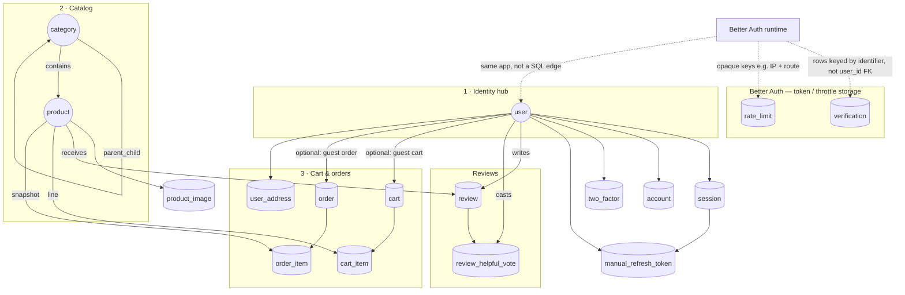
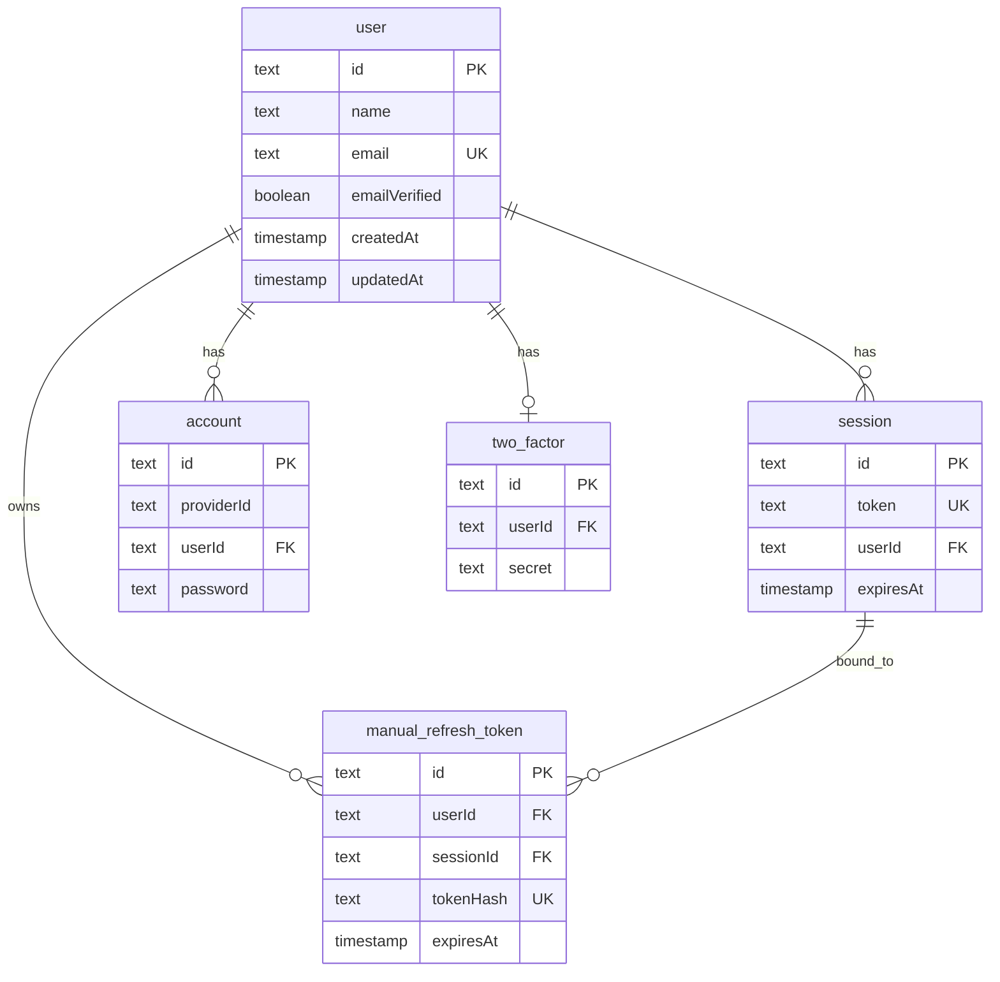
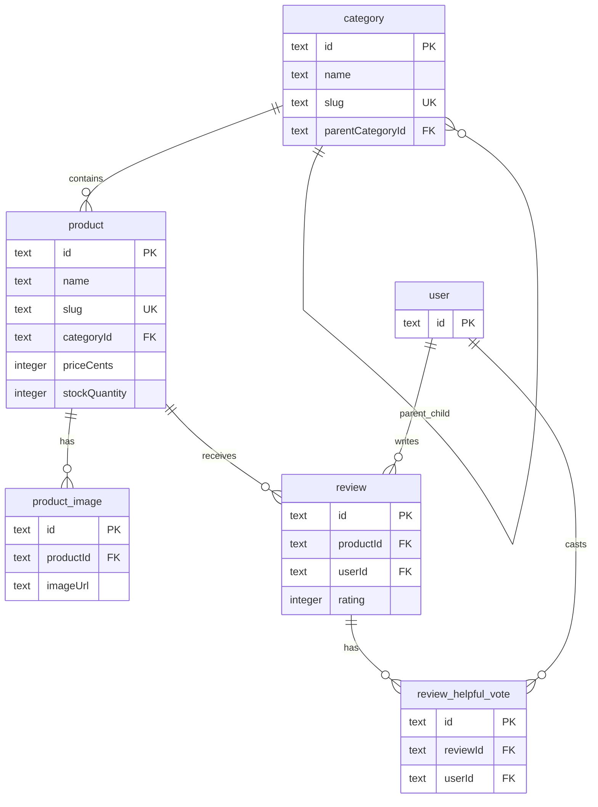
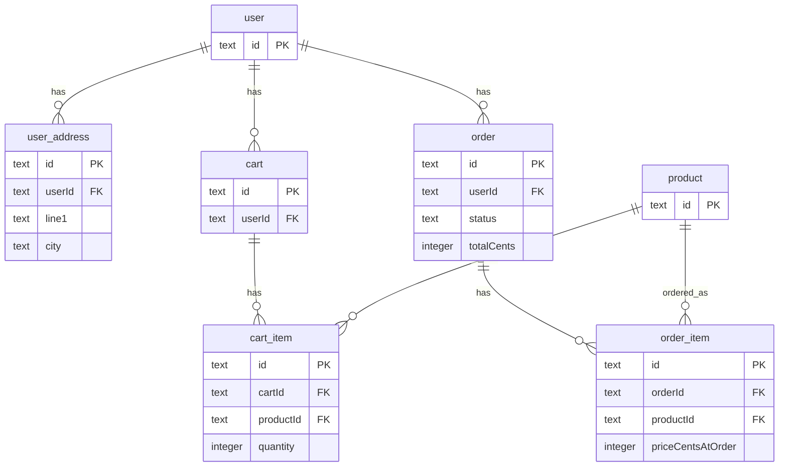

# Darkloom — B2C E-Commerce Platform

## Project Overview

**Darkloom** (codename tshirtshop) is a Business-to-Consumer (B2C) e-commerce platform built as a modular monolith. It provides secure user accounts, a structured product catalog, shopping cart, checkout with Stripe payments, order management, and an admin dashboard.

The platform is organized into three interconnected projects:

- **Project 1 (Foundation)** — User authentication, PostgreSQL database, product catalog with search and browse
- **Project 2 (Commerce)** — Cart, checkout, Stripe payments, order lifecycle
- **Project 3 (Experience)** — Customer-facing UI, admin dashboards, security and performance features

| Layer        | Technologies                                         |
| ------------ | ---------------------------------------------------- |
| **Monorepo** | Turborepo, npm workspaces, TypeScript                |
| **Backend**  | NestJS, PostgreSQL, Drizzle ORM, better-auth         |
| **Frontend** | Next.js (App Router), React, Tailwind CSS, shadcn/ui |

---

## Entity Relationship Diagram

The database follows ACID rules. ERD pieces: **entities**, **attributes**, **relationships**, **PKs**, **FKs**, **cardinality**, **modality**.

**How to read this:** start with the **conceptual map** (where data flows), then use the three **domain diagrams** for column-level detail. A **full single diagram** is in [docs/ERD.md](docs/ERD.md).

### Conceptual map — where everything connects

Solid lines = foreign keys in PostgreSQL. Dotted lines = tables Better Auth uses **without** a `user_id` FK.



### Domain 1 — Login, sessions, refresh tokens (SQL FKs only)



_`verification` and `rate_limit`_ live in the conceptual map: **no FK to `user`**. Better Auth matches `verification.identifier` to a user in application code.

### Domain 2 — Categories, products, images, reviews



### Domain 3 — Addresses, cart, checkout, orders



| Schema      | Tables                                                                             | Purpose                                                  |
| ----------- | ---------------------------------------------------------------------------------- | -------------------------------------------------------- |
| **Auth**    | user, session, account, verification, two_factor, rate_limit, manual_refresh_token | User accounts, OAuth, 2FA, rate limiting, refresh tokens |
| **Catalog** | category, product, product_image                                                   | Categories, products, images                             |
| **Address** | user_address                                                                       | Saved shipping/billing addresses                         |
| **Cart**    | cart, cart_item                                                                    | Guest and user carts                                     |
| **Order**   | order, order_item                                                                  | Orders, line items                                       |
| **Review**  | review, review_helpful_vote                                                        | Product reviews, helpful votes                           |

**Full ERD:** [docs/ERD.md](docs/ERD.md) — relationships, cardinality, modality, future tables.

---

## Setup and Installation Instructions

### Prerequisites

- **Node.js** 18+
- **PostgreSQL** 14+ (local or Docker)
- **npm** 11+

### Step 1 — Clone and Install

```bash
git clone <repository-url>
cd ecommerence/ecom/tshirtshop
npm install
```

### Step 2 — Environment Variables

Create `apps/backend/.env` (copy from `apps/backend/.env.example`):

| Variable                | Required     | Purpose                        |
| ----------------------- | ------------ | ------------------------------ |
| `DATABASE_URL`          | Yes          | PostgreSQL connection string   |
| `BETTER_AUTH_SECRET`    | Yes          | Cookie/token signing           |
| `ENCRYPTION_KEY`        | Yes          | 64-char hex for PII encryption |
| `BLIND_INDEX_SECRET`    | Yes          | Email lookup (user creation)   |
| `RESEND_API_KEY`        | For email    | Verification, password reset   |
| `STRIPE_SECRET_KEY`     | For payments | Stripe test key                |
| `STRIPE_WEBHOOK_SECRET` | For webhooks | Stripe webhook secret          |

Generate secrets:

```bash
node -e "console.log(require('crypto').randomBytes(32).toString('hex'))"
```

Create `apps/web/.env.local` with `API_URL` pointing to the backend (e.g. `http://localhost:3000`).

### Step 3 — Database

```bash
cd apps/backend
npm run db:push    # Apply schema
npm run db:seed    # Populate products and categories
```

### Step 4 — Run the Application

```bash
cd ecom/tshirtshop
npm run dev
```

- **Frontend:** http://localhost:3001
- **Backend API:** http://localhost:3000

### Build

```bash
cd ecom/tshirtshop
npm run build
```

### Run Tests

```bash
cd ecom/tshirtshop/apps/backend
npm test
```

---

## Usage Guide

### Customer Flow

1. **Browse** — View products by category, use faceted search (brand, price), sort by relevance/price/rating
2. **Search** — Type in search bar for dynamic suggestions
3. **Cart** — Add items (guest or logged-in). Cart persists across sessions for users
4. **Checkout** — Enter shipping address, apply coupon (e.g. `FRESHP100`), complete payment via Stripe
5. **Orders** — View order history, cancel pending orders, reorder

### Account Management

- **Register** — Email/password or OAuth (Google, Facebook). CAPTCHA on sign-up
- **Verify email** — Check inbox for verification link before first sign-in
- **Login** — JWT with access/refresh tokens. Optional 2FA (TOTP)
- **Password reset** — Request reset link via email

### Admin Dashboard

- **Products** — CRUD, bulk upload, archive
- **Orders** — View, update status, refund
- **Users** — List, ban, impersonate (admin plugin)
- **Reviews** — Moderate

Access admin at `/admin` (requires admin role).

---

## Additional Features and Bonus Functionality

| Feature                       | Description                                                                        |
| ----------------------------- | ---------------------------------------------------------------------------------- |
| **Stripe payments**           | Checkout Session, webhooks, refunds                                                |
| **Two-factor authentication** | TOTP (Google Authenticator), backup codes                                          |
| **Product reviews**           | Ratings, helpful votes, aggregation                                                |
| **Guest checkout**            | Checkout without account                                                           |
| **Coupon codes**              | e.g. FRESHP100 for free shipping                                                   |
| **Encryption at rest**        | PII (addresses, email) encrypted in DB                                             |
| **Local HTTPS**               | Self-signed certs for dev ([docs/LOCAL-HTTPS-SETUP.md](docs/LOCAL-HTTPS-SETUP.md)) |

---

## Project Structure

```
ecommerence/
├── docs/                    # Documentation
│   ├── START-HERE.md        # Developer entry point
│   ├── ERD.md               # Entity relationship diagram
│   ├── 01-REQUIREMENTS/
│   ├── 03-ARCHITECTURE/
│   ├── 04-TASKS/
│   └── 07-DEVOPS/
└── ecom/tshirtshop/         # Monorepo root
    ├── apps/
    │   ├── backend/         # NestJS API (port 3000)
    │   └── web/             # Next.js storefront (port 3001)
    └── packages/
        ├── eslint-config/
        └── typescript-config/
```

---

## Documentation

| Document                                                    | Purpose                                    |
| ----------------------------------------------------------- | ------------------------------------------ |
| [START-HERE.md](docs/START-HERE.md)                         | Developer entry point, architecture, rules |
| [ERD.md](docs/ERD.md)                                       | Full entity relationship diagram           |
| [PROJECT-STATUS-AUDIT.md](docs/PROJECT-STATUS-AUDIT.md)     | Implementation status                      |
| [environment-setup.md](docs/07-DEVOPS/environment-setup.md) | Detailed setup and troubleshooting         |
| [LOCAL-HTTPS-SETUP.md](docs/LOCAL-HTTPS-SETUP.md)           | HTTPS for local development                |

---

## Load Testing Report

### Overview

A full suite of k6 stress tests was run against the Darkloom backend to answer these questions:

1. What is the maximum number of concurrent users before response times exceed 5 seconds?
2. What are the code-level bottlenecks responsible for latency growth?

All tests ran against `https://localhost:3000` (local dev with self-signed TLS cert). Traffic was a realistic mix: **75% anonymous browsing** (products, categories, search suggestions) and **25% authenticated** (login → browse → add to cart → view cart). Authentication was handled once in `setup()` and the bearer token shared across all VUs to avoid triggering the IP-based rate limiter on the sign-in endpoint.

---

### Test Environment

| Setting                      | Value                                         |
| ---------------------------- | --------------------------------------------- |
| **Tool**                     | k6                                            |
| **Backend**                  | NestJS + Drizzle ORM + PostgreSQL             |
| **Protocol**                 | HTTPS (self-signed cert)                      |
| **Auth endpoint**            | `/api/auth/sign-in/email` (BetterAuth native) |
| **Traffic split**            | 75% anonymous, 25% authenticated              |
| **Thresholds (stress test)** | p99 < 3 000 ms, error rate < 5%, checks > 90% |

---

### Part 1 — Stress Test at 160 VUs

The primary stress test ramped from 20 to 160 VUs across six stages over 16 minutes, then cooled down.

**Ramp profile:**

| Stage     | Duration | Target VUs |
| --------- | -------- | ---------- |
| Warm-up   | 2 min    | 20         |
| Ramp 1    | 3 min    | 40         |
| Ramp 2    | 3 min    | 80         |
| Ramp 3    | 3 min    | 120        |
| Peak      | 3 min    | 160        |
| Cool-down | 2 min    | 0          |

**Results:**

| Metric            | Value        | Threshold  | Result  |
| ----------------- | ------------ | ---------- | ------- |
| Total requests    | ~99 000      | —          | —       |
| Throughput        | 103.34 req/s | —          | —       |
| Checks passed     | 100%         | > 90%      | ✅ PASS |
| Error rate        | 0.00%        | < 5%       | ✅ PASS |
| p50 response time | ~320 ms      | —          | —       |
| p90 response time | ~1 200 ms    | —          | —       |
| p95 response time | ~1 800 ms    | —          | —       |
| p99 response time | **2 860 ms** | < 3 000 ms | ✅ PASS |
| Max response time | ~4 100 ms    | —          | —       |

All three thresholds passed. The system handled 160 concurrent users with zero errors and p99 comfortably inside the 3-second budget.

---

### Part 2 — Capacity Finder: Maximum Concurrent Users Before p95 > 5 s

A binary-search series of fixed-load tests was run to find the exact concurrency ceiling. Each test held the target VU count steady for 3 minutes after a 2-minute ramp. The metric used is **p95 < 5 s** — meaning 95% of all HTTP requests must complete within 5 seconds.

| VUs       | p90        | p95        | p99    | Error rate | p95 < 5 s?             |
| --------- | ---------- | ---------- | ------ | ---------- | ---------------------- |
| 170       | 8 ms       | 12 ms      | 23 ms  | 0%         | ✅                     |
| 300       | 119 ms     | 188 ms     | 398 ms | 0%         | ✅                     |
| 500       | 473 ms     | 821 ms     | 1.82 s | 0%         | ✅                     |
| 600       | 653 ms     | 1.13 s     | 2.53 s | 0%         | ✅                     |
| 700       | 834 ms     | 1.44 s     | 3.24 s | 0%         | ✅                     |
| 900       | 1.22 s     | 2.12 s     | 4.78 s | 0%         | ✅                     |
| 1 200     | 1.83 s     | 3.19 s     | 7.20 s | 0%         | ✅                     |
| 1 500     | 2.44 s     | 4.26 s     | 9.64 s | 0%         | ✅                     |
| **1 650** | **2.68 s** | **4.67 s** | 10.6 s | **0%**     | ✅ **last safe point** |
| **1 750** | **2.91 s** | **5.06 s** | 11.5 s | **0%**     | ❌ **first breach**    |
| 2 000     | 3.46 s     | 5.99 s     | 13.5 s | 0%         | ❌                     |

**The 5-second threshold was first exceeded at 1 750 VUs (p95 = 5.06 s).** The last safe operating point is **1 650 concurrent users (p95 = 4.67 s)**.

#### Why latency grows gradually instead of crashing

Across all 11 tests — including 2 000 VUs — the error rate never exceeded 0%. The server does not drop requests; it queues them. This is graceful degradation: the system stays functional but progressively slower as the DB connection pool fills up and requests wait longer for a slot. The shape of the p95 curve (roughly linear from 170 to 1 650 VUs) confirms the bottleneck is queue depth, not capacity to process.

---

### Part 3 — Bottlenecks Responsible for Latency Growth

The following bottlenecks were identified through static code review of the backend source. They are the root causes of the latency curve seen in Part 2, and the reason p95 climbs from 12 ms at 170 VUs to 4.67 s at 1 650 VUs.

---

#### Bottleneck 1 — Unbounded Database Connection Pool

**File:** `apps/backend/src/database/database.module.ts`

```ts
// No pool config — pg defaults to max: 10 connections
new Pool({ connectionString: configService.getOrThrow("DATABASE_URL") });
```

The `pg` library defaults to a maximum of **10 simultaneous database connections**. Every incoming HTTP request that touches the database must acquire one of those 10 slots. With 1 650 VUs, each running a multi-step flow, hundreds of requests compete for those 10 connections simultaneously. Requests queue. Each millisecond in the queue adds directly to p95 and p99.

This is the primary driver of the latency curve — every other bottleneck below amplifies this one by holding connections open longer per request.

**Fix:** Set explicit pool options:

```ts
new Pool({
  connectionString: ...,
  max: 50,
  idleTimeoutMillis: 30_000,
  connectionTimeoutMillis: 5_000,
})
```

---

#### Bottleneck 2 — Full-Table Scans on Every Product Listing

**File:** `apps/backend/src/catalog/catalog.service.ts`

```ts
// Runs on every GET /api/v1/products request, regardless of page size
const images = await this.db.select().from(productImage); // entire table
const categories = await this.db.select().from(category); // entire table
```

Every paginated product request — even for a single page of 20 products — reads the entire `product_image` table and the entire `category` table, then filters in JavaScript. With 1 650 VUs, this creates hundreds of simultaneous full-table reads per second. Each one holds a connection slot open for longer than necessary and churns through I/O unnecessarily.

**Fix:** Replace with a JOIN scoped to the products on the current page, so only the rows actually needed are fetched.

---

#### Bottleneck 3 — N+1 Query Pattern in Order Listing

**File:** `apps/backend/src/order/order.service.ts`

```ts
// Inside getOrdersByUserId() and getAllOrders()
for (const o of orders) {
  const dto = await this.getOrderById(o.id); // sequential: 1 DB round trip per order
}
```

If a user has 10 orders, this loop makes 10 sequential round trips to the database — one for each order — instead of a single JOIN. The `await` in each iteration means they cannot run in parallel. A connection slot is held for the entire duration of all 10 trips. Under concurrent load, multiple users listing orders simultaneously stack these chains, exhausting pool slots rapidly.

**Fix:** Load all orders with their items in a single JOIN query, then map the result in memory.

---

#### Bottleneck 4 — Multiple Sequential Round Trips per Add-to-Cart

**File:** `apps/backend/src/cart/cart.service.ts`

Each `addItem()` call performs these steps sequentially (each `await` blocks the next):

1. Fetch or create the cart row
2. Fetch the product to validate it exists and read the price
3. Check whether the item already exists in the cart
4. Perform the `INSERT` or `UPDATE`
5. Re-read the full enriched cart to return in the response

That is 5 database round trips per add-to-cart action, holding a connection slot the entire time. The 25% authenticated traffic in the test means roughly 1 in 4 VUs is calling this on every iteration, making it a consistent source of pool pressure at high concurrency.

**Fix:** Combine the stock check and upsert into a single `INSERT ... ON CONFLICT ... DO UPDATE` statement; return the enriched cart via a single JOIN fetch.

---

#### Bottleneck 5 — Missing Indexes on Foreign Keys and Filter Columns

No explicit indexes exist on the following columns, which are used in `WHERE` or `JOIN` clauses on every relevant request:

| Table           | Column        | Used by               |
| --------------- | ------------- | --------------------- |
| `product_image` | `product_id`  | Product listing JOIN  |
| `cart_item`     | `cart_id`     | Cart fetch WHERE      |
| `order_item`    | `order_id`    | Order detail JOIN     |
| `order`         | `user_id`     | Order listing WHERE   |
| `product`       | `category_id` | Category filter WHERE |

Without indexes, PostgreSQL performs a sequential scan of the entire table for each lookup. Under 1 650 VUs, hundreds of concurrent sequential scans on the same tables create I/O contention and extend the time each query holds its connection slot open.

**Fix:** Add `CREATE INDEX ON <table>(<column>)` for all entries above. Foreign key columns should almost always be indexed.

---

#### Bottleneck 6 — No Caching on Read-Heavy Catalog Endpoints

Product listings and category trees are the most-called endpoints (75% of traffic) and change infrequently — typically only when an admin updates the catalog. Despite this, every request executes the full database query chain from scratch.

At 1 650 VUs and ~620 req/s, the same `SELECT * FROM category` query may run hundreds of times per second, each producing an identical result.

**Fix:** Add a short TTL in-process cache (30–60 seconds) for catalog reads. At 620 req/s, a 30-second cache eliminates ~18 000 redundant category queries per cache window, directly reducing pool pressure and freeing connections for write-heavy operations like add-to-cart.

---

### Summary

| Question                                   | Answer                                                                                                                   |
| ------------------------------------------ | ------------------------------------------------------------------------------------------------------------------------ |
| Maximum concurrent users before p95 > 5 s? | **~1 650 VUs** (p95 = 4.67 s)                                                                                            |
| What causes latency to grow?               | DB connection pool exhaustion, amplified by full-table scans, N+1 query loops, and multi-step sequential cart operations |

The system degrades **gracefully** under overload — no requests are dropped even at 2 000 VUs. The bottleneck is latency caused by connection queue depth, not server instability. Addressing bottlenecks 1 (pool size) and 5 (missing indexes) alone would significantly raise the concurrency ceiling without any architectural changes.
