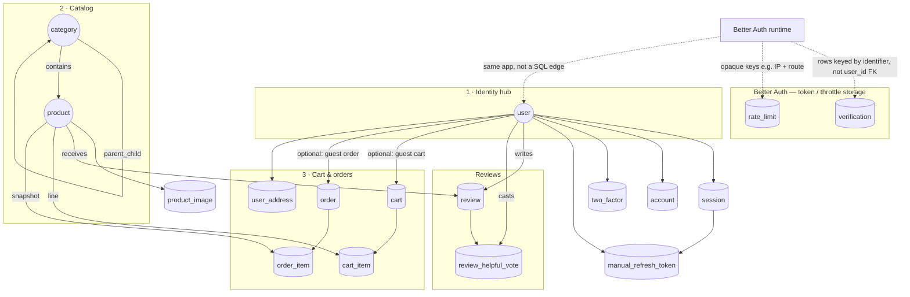
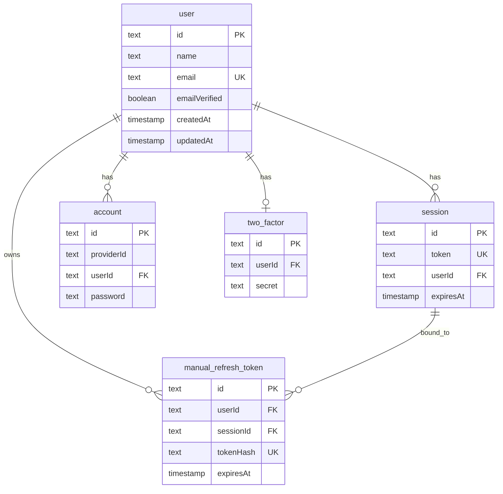
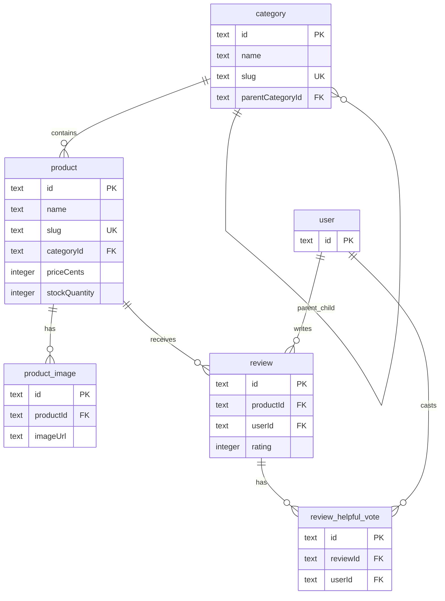
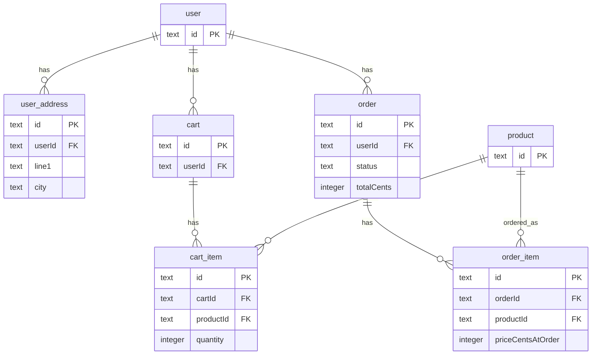

# Darkloom — B2C E-Commerce Platform

## Project overview

**Darkloom** (monorepo codename **tshirtshop**) is a Business-to-Consumer (B2C) e-commerce platform built as a **modular monolith**. It provides secure user accounts, a structured product catalog, shopping cart, checkout with Stripe payments, order management, reviews, and an admin dashboard.

The platform is organized into **three interconnected projects** (coursework phases):

- **Project 1 (Foundation)** — User authentication, PostgreSQL database, product catalog with search and browse  
- **Project 2 (Commerce)** — Cart, checkout, Stripe payments, order lifecycle  
- **Project 3 (Experience)** — Customer-facing UI, admin dashboards, security and performance features  

| Layer        | Technologies                                         |
| ------------ | ---------------------------------------------------- |
| **Monorepo** | Turborepo, npm workspaces, TypeScript                |
| **Backend**  | NestJS, PostgreSQL, Drizzle ORM, Better Auth         |
| **Frontend** | Next.js (App Router), React, Tailwind CSS, shadcn/ui |

The database is **relational** and designed for **ACID** transactions (atomicity, consistency, isolation, durability) for catalog, cart, and order flows.

The runnable application lives under **`ecom/tshirtshop`**. Unless noted otherwise, commands below use that path.

---

## Coursework README deliverables & review alignment

Per the **i love shopping** specification and the **testing / review checklist**, this README includes:

| Deliverable | Where |
| ----------- | ----- |
| Project overview | Above |
| **Entity Relationship Diagram** (entities, attributes, relationships, PKs, FKs, cardinality, modality) | [Entity Relationship Diagram](#entity-relationship-diagram) |
| Setup and installation | [How to run the project](#how-to-run-the-project) |
| Usage guide | [Usage guide](#usage-guide) |
| **Performance analysis** (load testing: concurrency, throughput, bottlenecks) | [Performance analysis (load testing)](#performance-analysis-load-testing) |
| Bonus / additional features | [Additional features](#additional-features-and-bonus-functionality) |

**Automated tests** (run regularly; see sections below):

- **Backend:** unit, API integration, and security-oriented tests — `npm test` from `ecom/tshirtshop` or `ecom/tshirtshop/apps/backend`.
- **Storefront E2E:** Playwright — `npm run test:e2e` from `ecom/tshirtshop`.

**Manual tests** called out in the review checklist (periodic / demo): CAPTCHA behavior, OAuth flows, 2FA setup and login, and admin-specific flows (e.g. admin 2FA). Use a staging or local environment with real providers configured.

---

## How to run the project

### Prerequisites

- **Node.js** 18+
- **npm** (workspaces; see `ecom/tshirtshop/package.json` for `packageManager`)
- **PostgreSQL** 14+
- **Redis** (BullMQ / payment events) — e.g. `docker run -d -p 6379:6379 redis:7-alpine`

### Install

```bash
cd ecom/tshirtshop
npm install
```

### 1. Backend environment

Create **`ecom/tshirtshop/apps/backend/.env`** from **`apps/backend/.env.example`**.

| Variable | Required | Purpose |
| -------- | -------- | ------- |
| `DATABASE_URL` | Yes | PostgreSQL connection string |
| `BETTER_AUTH_SECRET` | Yes | Cookie / token signing |
| `ENCRYPTION_KEY` | Yes | 64-character hex for PII encryption |
| `BLIND_INDEX_SECRET` | Yes | Deterministic email lookups (user creation) |
| `REDIS_URL` | Yes for full stack | e.g. `redis://localhost:6379` |
| `UI_URL` | Recommended | Storefront origin (e.g. `http://localhost:3001`) |
| `RESEND_API_KEY` | For email flows | Verification, password reset |
| `STRIPE_SECRET_KEY`, `STRIPE_WEBHOOK_SECRET` | For real payments | Use [Stripe test keys](https://stripe.com/docs/keys) in development |

Generate random secrets:

```bash
node -e "console.log(require('crypto').randomBytes(32).toString('hex'))"
```

### 2. Web environment

Create **`ecom/tshirtshop/apps/web/.env.local`** from **`apps/web/.env.example`**.

- Set **`API_URL`** to your backend (often `http://127.0.0.1:3000` — on Windows, `127.0.0.1` can avoid some `localhost` resolution issues).
- Set **`NEXT_PUBLIC_STRIPE_PUBLISHABLE_KEY`** to your Stripe **test** publishable key when exercising checkout.

### 3. Database

From **`ecom/tshirtshop/apps/backend`**:

```bash
npm run db:push
npm run db:seed
```

`db:push` applies the schema; `db:seed` loads categories and sample products so the storefront and E2E tests have data.

### 4. Run the stack

From **`ecom/tshirtshop`**:

```bash
npm run dev
```

Typical local URLs:

- **Storefront (Next.js):** http://localhost:3001  
- **API (NestJS):** http://localhost:3000  

Ports follow **`PORT`** / **`UI_URL`** in your env files if you change them.

### Build (production bundle)

```bash
cd ecom/tshirtshop
npm run build
```

### Automated backend tests

```bash
cd ecom/tshirtshop/apps/backend
npm test
```

Or from the monorepo app root:

```bash
cd ecom/tshirtshop
npm test
```

---

## End-to-end tests (Playwright)

E2E tests live in **`ecom/tshirtshop/apps/web/e2e`**. They drive the real storefront against **`PLAYWRIGHT_BASE_URL`** (default **`https://localhost:3001`** in Playwright config — match TLS or override the URL; see below).

### Install the browser (once per machine)

```bash
cd ecom/tshirtshop/apps/web
npx playwright install chromium
```

### Run E2E

From **`ecom/tshirtshop`** (runs Turbo with `--filter=web`):

```bash
npm run test:e2e
```

From **`ecom/tshirtshop/apps/web`**:

```bash
npm run test:e2e
```

| Command | Purpose |
| ------- | ------- |
| `npm run test:e2e` | Default headless run |
| `npm run test:e2e:ui` | Playwright UI mode (debug, time travel) |
| `npm run test:e2e:headed` | Visible Chromium |

After a run, open the HTML report:

```bash
cd ecom/tshirtshop/apps/web
npx playwright show-report
```

**`playwright.config.ts`** loads **`apps/web/.env.local`**, so `E2E_USER_*` and related variables apply without exporting them in the shell.

### Configure the E2E test account (authenticated tests)

The spec **`e2e/authenticated.spec.ts`** signs in via **`POST /api/auth/sign-in/email`** in a `beforeEach` hook. It needs a real Better Auth user.

1. Use an account that is **email verified** and has **no 2FA** (2FA breaks the API sign-in used in the test).
2. Add to **`ecom/tshirtshop/apps/web/.env.local`** (do not commit real passwords):

   ```env
   E2E_USER_EMAIL=your-verified-user@example.com
   E2E_USER_PASSWORD=your-secure-password
   ```

3. If the password contains special characters (e.g. `%`), quote the value:

   ```env
   E2E_USER_PASSWORD='your%password'
   ```

4. **CI:** set the same variables as secrets in your pipeline.

If **`E2E_USER_EMAIL`** or **`E2E_USER_PASSWORD`** is missing, **`authenticated.spec.ts` is skipped** (not failed) so the rest of the suite can still pass.

### Why the sign-up / reCAPTCHA test might be skipped

The spec **`e2e/signup.spec.ts`** calls **`POST /api/auth/sign-up/email`** (no browser reCAPTCHA widget).

- If the backend **does not require reCAPTCHA** on that route (e.g. no **`RECAPTCHA_SECRET_KEY`** in `apps/backend/.env` for local dev), the API can succeed and the test **passes**.
- If **`RECAPTCHA_SECRET_KEY`** is set, the server typically requires a captcha token on sign-up. The test does not send one, so the API returns an error the test treats as “CAPTCHA required,” and the spec **`test.skip`s** with a message like *“Sign-up requires CAPTCHA…”*. That is intentional: automating real reCAPTCHA in CI is flaky, so the default E2E path **skips** instead of failing.

**To run the sign-up test green:** use a local backend **without** `RECAPTCHA_SECRET_KEY`, or an environment where sign-up does not enforce CAPTCHA on that endpoint.

### Prerequisites for a full green E2E run

1. **Chromium:** `npx playwright install chromium`
2. **Stack running:** Postgres, Redis, backend + Next at **`PLAYWRIGHT_BASE_URL`** (default is often **`https://localhost:3001`** — use HTTPS dev certs or set **`PLAYWRIGHT_BASE_URL=http://localhost:3001`** if your dev server is HTTP-only).
3. **Catalog:** At least one product (e.g. after **`npm run db:seed`** in `apps/backend`).
4. **Schema:** Run **`npm run db:push`** in `apps/backend` so delivery-related tables exist — checkout can error if they are missing.
5. **Checkout / Stripe in E2E:** When Playwright starts `npm run dev`, it can set **`E2E_SKIP_STRIPE_CHECKOUT=1`** for the monorepo (dev-only; ignored in production) so the backend skips creating a Stripe Checkout session and the browser reaches **`/checkout/confirmation`** without valid Stripe keys. To exercise the real Stripe redirect, unset that on the backend and use valid Stripe test keys. If you use **`PLAYWRIGHT_SKIP_WEBSERVER=1`**, set **`E2E_SKIP_STRIPE_CHECKOUT=1`** in `apps/backend/.env` or your shell so behavior matches.
6. **Auth tests:** Set **`E2E_USER_EMAIL`** and **`E2E_USER_PASSWORD`** as above.
7. **Sign-up test:** See the reCAPTCHA section above.

### E2E environment variables (reference)

| Variable | Purpose |
| -------- | ------- |
| `PLAYWRIGHT_BASE_URL` | Override default base URL (must match how you run the app: `http` vs `https`) |
| `PLAYWRIGHT_SKIP_WEBSERVER` | `1` = you already run `npm run dev` from the monorepo root |
| `E2E_USER_EMAIL` / `E2E_USER_PASSWORD` | Required for **`authenticated.spec.ts`** |
| `E2E_RECAPTCHA_SITEKEY` | Override site key for the Playwright process (e.g. Google test key) |
| `E2E_STRIP_RECAPTCHA` | `1` = clear `NEXT_PUBLIC_RECAPTCHA_SITEKEY` unless `E2E_RECAPTCHA_SITEKEY` is set |
| `E2E_KEEP_RECAPTCHA` | `1` = legacy: keep `.env.local` reCAPTCHA as loaded (advanced) |
| `E2E_SKIP_STRIPE_CHECKOUT` | `1` on **backend** (dev): skip Stripe session; confirmation page only. Playwright’s `webServer` may set this automatically. |

Tests **fail** when the catalog is empty, checkout never reaches confirmation, sign-up fails unexpectedly, or the auth page fails to load. **Auth** tests are **skipped** when `E2E_USER_*` are unset. **Sign-up** is **skipped** when the server requires CAPTCHA (see above).

### What E2E covers (high level)

Smoke, catalog, guest cart, checkout (guest), registration, authenticated header — see specs under **`apps/web/e2e`**.

---

## Entity Relationship Diagram

The database follows **ACID** rules. ERD components: **entities**, **attributes**, **relationships**, **primary keys**, **foreign keys**, **cardinality**, and **modality**.

**How to read this:** start with the **conceptual map** (where data flows), then use the three **domain diagrams** for column-level detail.

### Conceptual map — where everything connects

Solid lines = foreign keys in PostgreSQL. Dotted lines = tables Better Auth uses **without** a `user_id` FK.



### Domain 1 — Login, sessions, refresh tokens (SQL FKs only)



_`verification` and `rate_limit`_ appear in the conceptual map: **no FK to `user`**. Better Auth matches `verification.identifier` to a user in application code.

### Domain 2 — Categories, products, images, reviews



### Domain 3 — Addresses, cart, checkout, orders



| Schema      | Tables                                                                             | Purpose                                                  |
| ----------- | ---------------------------------------------------------------------------------- | -------------------------------------------------------- |
| **Auth**    | user, session, account, verification, two_factor, rate_limit, manual_refresh_token | User accounts, OAuth, 2FA, rate limiting, refresh tokens |
| **Catalog** | category, product, product_image                                                   | Categories, products, images                             |
| **Address** | user_address                                                                       | Saved shipping/billing addresses                         |
| **Cart**    | cart, cart_item                                                                    | Guest and user carts                                     |
| **Order**   | order, order_item                                                                  | Orders, line items                                       |
| **Review**  | review, review_helpful_vote                                                        | Product reviews, helpful votes                           |

---

## Performance analysis (load testing)

> **Note:** The following report reflects **k6** runs against a **development** backend build at the time of measurement. Pool sizing, indexes, and query code **may have changed** — confirm current behavior in `apps/backend` (e.g. `database.module.ts`, catalog and order services) before treating bottleneck notes as a live audit.

### Overview

A full suite of k6 stress tests was run against the Darkloom backend to answer:

1. What is the maximum number of concurrent users before response times exceed 5 seconds?
2. What are the code-level bottlenecks responsible for latency growth?

All tests ran against `https://localhost:3000` (local dev with self-signed TLS cert). Traffic was a realistic mix: **75% anonymous browsing** (products, categories, search suggestions) and **25% authenticated** (login → browse → add to cart → view cart). Authentication was handled once in `setup()` and the bearer token shared across all VUs to avoid triggering the IP-based rate limiter on the sign-in endpoint.

### Test environment

| Setting                      | Value                                         |
| ---------------------------- | --------------------------------------------- |
| **Tool**                     | k6                                            |
| **Backend**                  | NestJS + Drizzle ORM + PostgreSQL             |
| **Protocol**                 | HTTPS (self-signed cert)                      |
| **Auth endpoint**            | `/api/auth/sign-in/email` (Better Auth)       |
| **Traffic split**            | 75% anonymous, 25% authenticated              |
| **Thresholds (stress test)** | p99 < 3 000 ms, error rate < 5%, checks > 90% |

### Part 1 — Stress test at 160 VUs

The primary stress test ramped from 20 to 160 VUs across six stages over 16 minutes, then cooled down.

**Ramp profile:**

| Stage     | Duration | Target VUs |
| --------- | -------- | ---------- |
| Warm-up   | 2 min    | 20         |
| Ramp 1    | 3 min    | 40         |
| Ramp 2    | 3 min    | 80         |
| Ramp 3    | 3 min    | 120        |
| Peak      | 3 min    | 160        |
| Cool-down | 2 min    | 0          |

**Results:**

| Metric            | Value        | Threshold  | Result  |
| ----------------- | ------------ | ---------- | ------- |
| Total requests    | ~99 000      | —          | —       |
| Throughput        | 103.34 req/s | —          | —       |
| Checks passed     | 100%         | > 90%      | ✅ PASS |
| Error rate        | 0.00%        | < 5%       | ✅ PASS |
| p50 response time | ~320 ms      | —          | —       |
| p90 response time | ~1 200 ms    | —          | —       |
| p95 response time | ~1 800 ms    | —          | —       |
| p99 response time | **2 860 ms** | < 3 000 ms | ✅ PASS |
| Max response time | ~4 100 ms    | —          | —       |

All three thresholds passed. The system handled 160 concurrent users with zero errors and p99 comfortably inside the 3-second budget.

### Part 2 — Capacity finder: maximum concurrent users before p95 > 5 s

A binary-search series of fixed-load tests was run to find the concurrency ceiling. Each test held the target VU count steady for 3 minutes after a 2-minute ramp. The metric used is **p95 < 5 s**.

| VUs       | p90        | p95        | p99    | Error rate | p95 < 5 s?             |
| --------- | ---------- | ---------- | ------ | ---------- | ---------------------- |
| 170       | 8 ms       | 12 ms      | 23 ms  | 0%         | ✅                     |
| 300       | 119 ms     | 188 ms     | 398 ms | 0%         | ✅                     |
| 500       | 473 ms     | 821 ms     | 1.82 s | 0%         | ✅                     |
| 600       | 653 ms     | 1.13 s     | 2.53 s | 0%         | ✅                     |
| 700       | 834 ms     | 1.44 s     | 3.24 s | 0%         | ✅                     |
| 900       | 1.22 s     | 2.12 s     | 4.78 s | 0%         | ✅                     |
| 1 200     | 1.83 s     | 3.19 s     | 7.20 s | 0%         | ✅                     |
| 1 500     | 2.44 s     | 4.26 s     | 9.64 s | 0%         | ✅                     |
| **1 650** | **2.68 s** | **4.67 s** | 10.6 s | **0%**     | ✅ **last safe point** |
| **1 750** | **2.91 s** | **5.06 s** | 11.5 s | **0%**     | ❌ **first breach**    |
| 2 000     | 3.46 s     | 5.99 s     | 13.5 s | 0%         | ❌                     |

**The 5-second threshold was first exceeded at 1 750 VUs (p95 = 5.06 s).** The last safe operating point is **1 650 concurrent users (p95 = 4.67 s)**.

#### Why latency grows gradually instead of crashing

Across all 11 tests — including 2 000 VUs — the error rate never exceeded 0%. The server does not drop requests; it queues them. This is graceful degradation: the system stays functional but progressively slower as the database connection pool fills up and requests wait longer for a slot.

### Part 3 — Bottlenecks responsible for latency growth

The following bottlenecks were identified through **static code review** of the backend at the time of the load campaign. They explain why p95 climbs from 12 ms at 170 VUs to 4.67 s at 1 650 VUs.

#### Bottleneck 1 — Database connection pool

**File:** `apps/backend/src/database/database.module.ts`

The `pg` **Pool** limits concurrent connections. A small cap increases queueing under many concurrent VUs. Example shape (values may differ in your checkout of the repo):

```ts
const pool = new Pool({
  connectionString: configService.getOrThrow("DATABASE_URL"),
  max: 5,
  idleTimeoutMillis: 10000,
  connectionTimeoutMillis: 10000,
});
```

Under high concurrency, many requests compete for pool slots; time spent waiting adds directly to p95/p99. Tuning `max`, query duration, and indexes together raises the practical ceiling.

#### Bottleneck 2 — Full-table reads on catalog paths

**File:** `apps/backend/src/catalog/catalog.service.ts`

Some product listing paths historically loaded large slices of `product_image` / `category` data. Full-table or wide reads per request increase I/O and hold connections longer than necessary.

**Direction:** Scope queries with JOINs/WHERE to the page of products needed, and ensure indexes support hot filters.

#### Bottleneck 3 — N+1 patterns in order listing

**File:** `apps/backend/src/order/order.service.ts`

Loops that call `getOrderById` (or equivalent) per order multiply round trips and hold a connection for the whole chain.

**Direction:** Prefer batched or JOINed loads for order lists.

#### Bottleneck 4 — Multiple sequential round trips per add-to-cart

**File:** `apps/backend/src/cart/cart.service.ts`

Several sequential `await` steps per `addItem()` increase latency and pool hold time.

**Direction:** Combine validation and upsert where possible; return enriched cart with minimal round trips.

#### Bottleneck 5 — Indexes on FKs and filter columns

Ensure indexes exist on columns used heavily in `JOIN` / `WHERE` (e.g. `product_image.product_id`, `cart_item.cart_id`, `order_item.order_id`, `order.user_id`, `product.category_id`) to avoid sequential scans at scale.

#### Bottleneck 6 — Caching on read-heavy catalog endpoints

Category trees and listing payloads are read-heavy and change infrequently. Short TTL in-process caching can reduce repeated identical queries under load.

### Summary

| Question                                   | Answer                                                                                                                   |
| ------------------------------------------ | ------------------------------------------------------------------------------------------------------------------------ |
| Maximum concurrent users before p95 > 5 s? | **~1 650 VUs** (p95 = 4.67 s) at time of report                                                                           |
| Expected throughput (stress window)        | **~103 req/s** (160 VU scenario)                                                                                         |
| What causes latency to grow?               | Connection pool queueing, amplified by heavy catalog reads, N+1 patterns, multi-step cart paths, and missing indexes/cache |

The system degrades **gracefully** under overload — errors stayed at **0%** even at 2 000 VUs in this campaign; the dominant effect was **latency** from queue depth, not hard failure.

---

## Additional features and bonus functionality

| Feature                       | Description                                                                        |
| ----------------------------- | ---------------------------------------------------------------------------------- |
| **Stripe payments**           | Checkout Session, webhooks, refunds                                                |
| **Two-factor authentication** | TOTP (e.g. Google Authenticator), backup codes                                     |
| **Product reviews**           | Ratings, helpful votes, aggregation                                                |
| **Guest checkout**            | Checkout without an account                                                        |
| **Coupon codes**              | e.g. `FRESHP100` for promotions / shipping                                       |
| **Encryption at rest**        | PII (addresses, email) encrypted in the database                                   |
| **Local HTTPS**               | Optional self-signed TLS for dev (`USE_HTTPS` / backend TLS scripts)               |

### Security posture (coursework baseline and beyond)

The **i love shopping** specification expects JWT-style sessions with rotation and revocation, CAPTCHA on registration, OAuth, optional user 2FA, token-bucket rate limiting, TLS, client and server validation, and encryption at rest for sensitive data — plus automated tests covering auth, validation, and abuse-style inputs.

Darkloom uses that as a **floor**:

- **Auth** — [Better Auth](https://www.better-auth.com/) drives **httpOnly cookie** sessions, refresh rotation, and revocation (avoiding common pitfalls such as storing access tokens in `localStorage`).
- **Payments** — **Stripe** hosts card collection; PAN/CVV are not stored on application servers, keeping PCI scope narrow.
- **Data at rest** — PII uses **field-level encryption** with a dedicated key; **blind indexing** supports lookups without storing plaintext email for search.
- **Defense in depth** — Role-gated admin APIs, **mandatory admin 2FA**, rate limiting on auth-sensitive routes, and server-side DTO validation complement client checks.

---

## Project layout

```
ecommerence/
└── ecom/tshirtshop/          # Monorepo root (npm workspaces + Turbo)
    ├── apps/
    │   ├── backend/          # NestJS API (default port 3000)
    │   └── web/              # Next.js storefront (default port 3001) + Playwright E2E
    └── packages/
        ├── eslint-config/
        └── typescript-config/
```

---

## Usage guide

### Customer flow

1. **Browse** — View products by category, use faceted search (brand, price), sort by relevance/price/rating  
2. **Search** — Type in the search bar for dynamic suggestions  
3. **Cart** — Add items (guest or logged-in). Logged-in carts persist across sessions  
4. **Checkout** — Enter shipping address, apply a coupon when applicable, complete payment via Stripe  
5. **Orders** — View order history, cancel eligible orders, track status  

### Account management

- **Register** — Email/password or OAuth (e.g. Google, Facebook). CAPTCHA on sign-up when configured  
- **Verify email** — Use the verification link before first sign-in where required  
- **Login** — Session-based auth with refresh rotation. Optional **2FA** (TOTP)  
- **Password reset** — Request a reset link via email  

### Admin dashboard

- **Products** — CRUD, bulk upload, archive  
- **Orders** — View, update status, refunds  
- **Users** — List, roles, moderation tools  
- **Reviews** — Moderation  

Access **`/admin`** (requires admin role). **All admin accounts must use 2FA** per the review checklist.

---

## License

See repository metadata or `LICENSE` if present.
