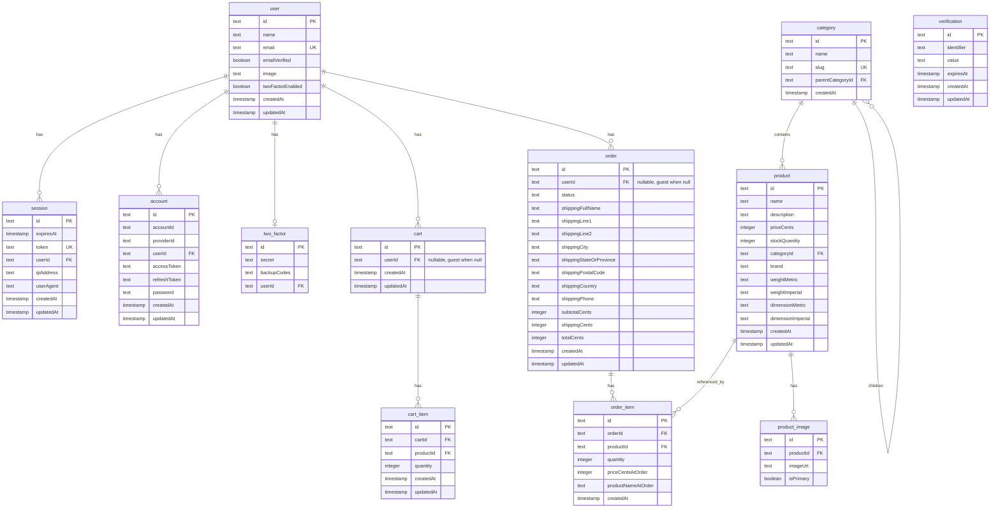

# Entity Relationship Diagram — Darkloom

**Created:** 2026-02-18 (DB-001)  
**Source:** `apps/backend/src/auth/schema.ts`, `apps/backend/src/catalog/schema.ts`, `apps/backend/src/cart/schema.ts`, `apps/backend/src/order/schema.ts`  
**Database:** PostgreSQL via Drizzle ORM

---

## 1. Current Schema (Implemented)

---

## 2. Entity Summary

| Schema | Table | Purpose |
|--------|-------|---------|
| **Auth** | `user` | User accounts (better-auth) |
| | `session` | Active sessions / JWT tokens |
| | `account` | OAuth providers, password hash |
| | `verification` | Email verification, password reset tokens |
| | `two_factor` | TOTP secrets, backup codes |
| **Catalog** | `category` | Product categories (hierarchical via parentCategoryId) |
| | `product` | Products with price, stock, brand |
| | `product_image` | Product images (one primary per product) |
| **Cart** | `cart` | Shopping cart (guest or user; userId null = guest) |
| | `cart_item` | Line items (product + quantity per cart) |
| **Order** | `order` | Placed orders (created at checkout; status: pending/paid/shipped/completed/cancelled) |
| | `order_item` | Line items with price snapshot at order time |

---

## 3. Key Relationships

| From | To | Type | On Delete |
|------|----|----|-----------|
| session.userId | user.id | many-to-one | CASCADE |
| account.userId | user.id | many-to-one | CASCADE |
| two_factor.userId | user.id | many-to-one | CASCADE |
| product.categoryId | category.id | many-to-one | RESTRICT |
| product_image.productId | product.id | many-to-one | CASCADE |
| category.parentCategoryId | category.id | self-ref, optional | — |
| cart.userId | user.id | many-to-one, optional | CASCADE |
| cart_item.cartId | cart.id | many-to-one | CASCADE |
| cart_item.productId | product.id | many-to-one | CASCADE |
| order.userId | user.id | many-to-one, optional | SET NULL |
| order_item.orderId | order.id | many-to-one | CASCADE |
| order_item.productId | product.id | many-to-one | RESTRICT |

---

## 4. Future Tables (Planned, Not Yet Implemented)

Per project-overview and master-task-board:

| Table | Purpose |
|-------|---------|
| `address` | Dedicated shipping/billing addresses (currently embedded in order) |
| `payment` | Payment records |
| `review` | Product reviews |
| `review_helpful_vote` | Helpful voting on reviews |

---

## 5. Diagram Reference

- **PK** = Primary key  
- **UK** = Unique key  
- **FK** = Foreign key  
- `||--o{` = one-to-many  
- `||--o|` = one-to-one (optional)

---

*End of ERD document*
