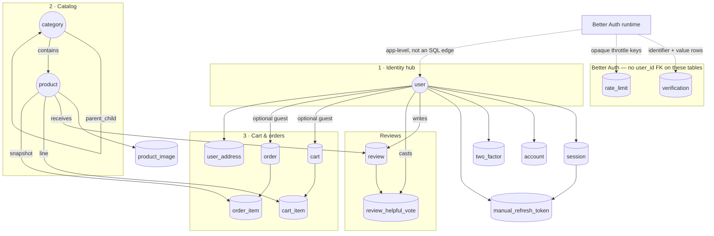
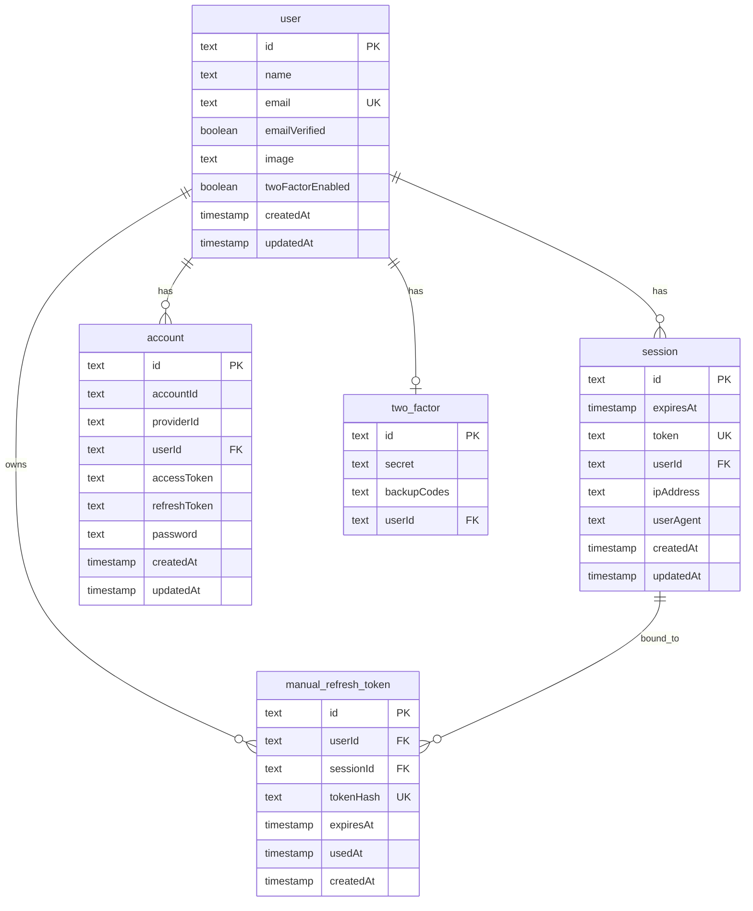
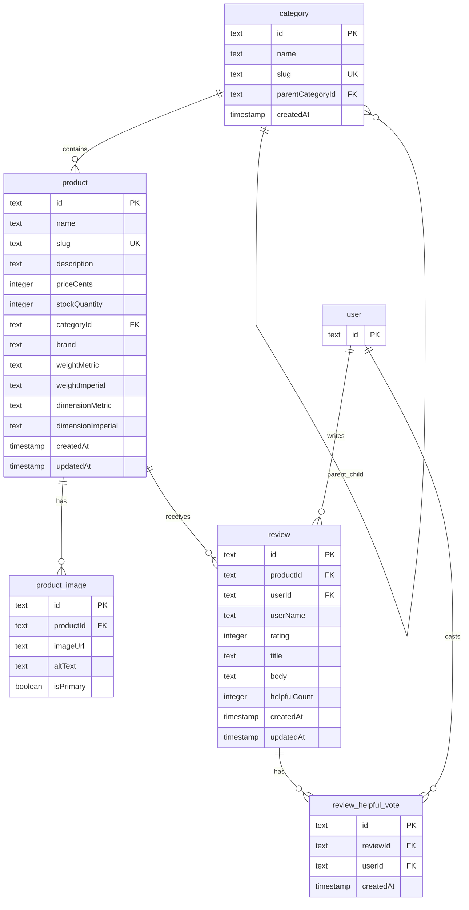
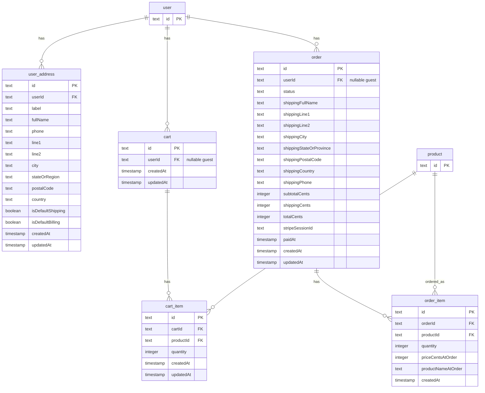
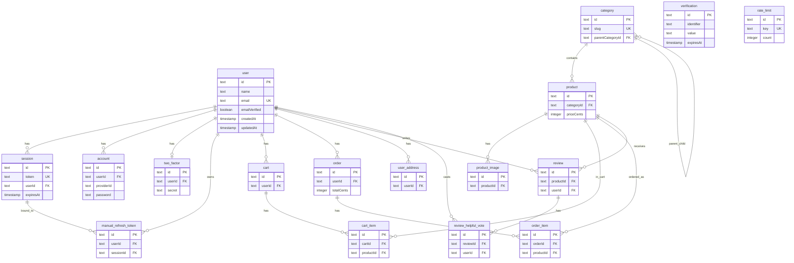

# Entity Relationship Diagram — Darkloom

**Created:** 2026-02-18 (DB-001)  
**Source:** `apps/backend/src/auth/schema.ts`, `apps/backend/src/address/schema.ts`, `apps/backend/src/catalog/schema.ts`, `apps/backend/src/cart/schema.ts`, `apps/backend/src/order/schema.ts`, `apps/backend/src/review/schema.ts`  
**Database:** PostgreSQL via Drizzle ORM

This ERD includes the key components required for task.md 1/3: **Entities**, **Attributes**, **Relationships**, **Primary Keys**, **Foreign Keys**, **Cardinality**, **Modality**.

---

## 1. How to read these diagrams

One giant ER diagram is hard to follow in Mermaid. This doc uses:

1. A **conceptual flowchart** — shows where data flows; dotted edges mean “no `user_id` FK in Postgres.”
2. **Three domain ER diagrams** — full attributes, only tables that belong together.
3. **Appendix: single combined ER** — one block for search/print; same content as before, all entities.

---

## 1a. Conceptual map (flow + Better Auth sidecars)

Solid arrows = **foreign keys**. Dotted arrows = **Better Auth** reads/writes tables **without** linking `verification` / `rate_limit` to `user` via SQL.

```mermaid
flowchart TB
    subgraph identity["1 · Identity hub"]
        user((user))
    end

    user --> session[(session)]
    user --> account[(account)]
    user --> two_factor[(two_factor)]
    user --> mrt[(manual_refresh_token)]
    session --> mrt

    subgraph ba_side["Better Auth — no user_id FK on these tables"]
        verification[(verification)]
        rate_limit[(rate_limit)]
    end

    BA[Better Auth runtime]
    BA -.->|identifier + value rows| verification
    BA -.->|opaque throttle keys| rate_limit
    BA -.->|app-level, not an SQL edge| user

    subgraph catalog["2 · Catalog"]
        category((category))
        product((product))
    end

    category -->|parent_child| category
    category -->|contains| product
    product --> pimg[(product_image)]

    subgraph social["Reviews"]
        review[(review)]
        vote[(review_helpful_vote)]
    end

    product -->|receives| review
    user -->|writes| review
    review --> vote
    user -->|casts| vote

    subgraph commerce["3 · Cart & orders"]
        cart[(cart)]
        citem[(cart_item)]
        ord[(order)]
        oitem[(order_item)]
        addr[(user_address)]
    end

    user -->|optional guest| cart
    user -->|optional guest| ord
    user --> addr
    cart --> citem
    product -->|line| citem
    ord --> oitem
    product -->|snapshot| oitem
```

---

## 1b. Domain 1 — Login, sessions, refresh tokens

```mermaid
erDiagram
    user ||--o{ session : has
    user ||--o{ account : has
    user ||--o| two_factor : has
    user ||--o{ manual_refresh_token : owns
    session ||--o{ manual_refresh_token : bound_to

    user {
        text id PK
        text name
        text email UK
        boolean emailVerified
        text image
        boolean twoFactorEnabled
        timestamp createdAt
        timestamp updatedAt
    }

    session {
        text id PK
        timestamp expiresAt
        text token UK
        text userId FK
        text ipAddress
        text userAgent
        timestamp createdAt
        timestamp updatedAt
    }

    account {
        text id PK
        text accountId
        text providerId
        text userId FK
        text accessToken
        text refreshToken
        text password
        timestamp createdAt
        timestamp updatedAt
    }

    two_factor {
        text id PK
        text secret
        text backupCodes
        text userId FK
    }

    manual_refresh_token {
        text id PK
        text userId FK
        text sessionId FK
        text tokenHash UK
        timestamp expiresAt
        timestamp usedAt
        timestamp createdAt
    }
```

**`verification` and `rate_limit`** — defined in appendix; no FK to `user`. Better Auth resolves `verification.identifier` in code.

---

## 1c. Domain 2 — Categories, products, images, reviews

```mermaid
erDiagram
    category ||--o{ category : parent_child
    category ||--o{ product : contains
    product ||--o{ product_image : has
    product ||--o{ review : receives
    user ||--o{ review : writes
    review ||--o{ review_helpful_vote : has
    user ||--o{ review_helpful_vote : casts

    category {
        text id PK
        text name
        text slug UK
        text parentCategoryId FK
        timestamp createdAt
    }

    product {
        text id PK
        text name
        text slug UK
        text description
        integer priceCents
        integer stockQuantity
        text categoryId FK
        text brand
        text weightMetric
        text weightImperial
        text dimensionMetric
        text dimensionImperial
        timestamp createdAt
        timestamp updatedAt
    }

    product_image {
        text id PK
        text productId FK
        text imageUrl
        text altText
        boolean isPrimary
    }

    review {
        text id PK
        text productId FK
        text userId FK
        text userName
        integer rating
        text title
        text body
        integer helpfulCount
        timestamp createdAt
        timestamp updatedAt
    }

    review_helpful_vote {
        text id PK
        text reviewId FK
        text userId FK
        timestamp createdAt
    }

    user {
        text id PK
    }
```

---

## 1d. Domain 3 — Addresses, cart, orders

```mermaid
erDiagram
    user ||--o{ user_address : has
    user ||--o{ cart : has
    user ||--o{ order : has
    cart ||--o{ cart_item : has
    product ||--o{ cart_item : in_cart
    order ||--o{ order_item : has
    product ||--o{ order_item : ordered_as

    user {
        text id PK
    }

    user_address {
        text id PK
        text userId FK
        text label
        text fullName
        text phone
        text line1
        text line2
        text city
        text stateOrRegion
        text postalCode
        text country
        boolean isDefaultShipping
        boolean isDefaultBilling
        timestamp createdAt
        timestamp updatedAt
    }

    cart {
        text id PK
        text userId FK "nullable guest"
        timestamp createdAt
        timestamp updatedAt
    }

    cart_item {
        text id PK
        text cartId FK
        text productId FK
        integer quantity
        timestamp createdAt
        timestamp updatedAt
    }

    order {
        text id PK
        text userId FK "nullable guest"
        text status
        text shippingFullName
        text shippingLine1
        text shippingLine2
        text shippingCity
        text shippingStateOrProvince
        text shippingPostalCode
        text shippingCountry
        text shippingPhone
        integer subtotalCents
        integer shippingCents
        integer totalCents
        text stripeSessionId
        timestamp paidAt
        timestamp createdAt
        timestamp updatedAt
    }

    order_item {
        text id PK
        text orderId FK
        text productId FK
        integer quantity
        integer priceCentsAtOrder
        text productNameAtOrder
        timestamp createdAt
    }

    product {
        text id PK
    }
```

---

## 1e. Appendix — combined ER (all entities, one diagram)

Use this when you need **one** Mermaid block (e.g. export). Layout may look busy; prefer **§1a–1d** when explaining.

```mermaid
erDiagram
    user ||--o{ session : has
    user ||--o{ account : has
    user ||--o| two_factor : has
    user ||--o{ manual_refresh_token : owns
    session ||--o{ manual_refresh_token : bound_to
    user ||--o{ cart : has
    user ||--o{ order : has
    user ||--o{ user_address : has
    user ||--o{ review : writes
    user ||--o{ review_helpful_vote : casts
    category ||--o{ product : contains
    category ||--o{ category : parent_child
    product ||--o{ product_image : has
    product ||--o{ cart_item : in_cart
    product ||--o{ order_item : ordered_as
    product ||--o{ review : receives
    cart ||--o{ cart_item : has
    order ||--o{ order_item : has
    review ||--o{ review_helpful_vote : has

    user {
        text id PK
        text name
        text email UK
        boolean emailVerified
        timestamp createdAt
        timestamp updatedAt
    }
    session {
        text id PK
        text token UK
        text userId FK
        timestamp expiresAt
    }
    account {
        text id PK
        text userId FK
        text providerId
        text password
    }
    verification {
        text id PK
        text identifier
        text value
        timestamp expiresAt
    }
    two_factor {
        text id PK
        text userId FK
        text secret
    }
    rate_limit {
        text id PK
        text key UK
        integer count
    }
    category {
        text id PK
        text slug UK
        text parentCategoryId FK
    }
    product {
        text id PK
        text categoryId FK
        integer priceCents
    }
    product_image {
        text id PK
        text productId FK
    }
    cart {
        text id PK
        text userId FK
    }
    cart_item {
        text id PK
        text cartId FK
        text productId FK
    }
    order {
        text id PK
        text userId FK
        integer totalCents
    }
    order_item {
        text id PK
        text orderId FK
        text productId FK
    }
    user_address {
        text id PK
        text userId FK
    }
    review {
        text id PK
        text productId FK
        text userId FK
    }
    review_helpful_vote {
        text id PK
        text reviewId FK
        text userId FK
    }
    manual_refresh_token {
        text id PK
        text userId FK
        text sessionId FK
    }
```

*`verification` and `rate_limit` appear here for completeness; they have **no** FK lines to `user` (see §1a).*

---

## 2. Entity Summary

| Schema | Table | Purpose |
|--------|-------|---------|
| **Auth** | `user` | User accounts (better-auth) |
| | `session` | Active sessions / JWT tokens |
| | `account` | OAuth providers, password hash |
| | `verification` | Email verification, password reset tokens |
| | `two_factor` | TOTP secrets, backup codes |
| | `manual_refresh_token` | Refresh token rotation, single-use validation |
| | `rate_limit` | Rate limiting (Better Auth) |
| **Address** | `user_address` | Saved shipping/billing addresses |
| **Catalog** | `category` | Product categories (hierarchical via parentCategoryId) |
| | `product` | Products with price, stock, brand |
| | `product_image` | Product images (one primary per product) |
| **Cart** | `cart` | Shopping cart (guest or user; userId null = guest) |
| | `cart_item` | Line items (product + quantity per cart) |
| **Order** | `order` | Placed orders (created at checkout; status: pending/paid/shipped/completed/cancelled/refunded) |
| | `order_item` | Line items with price snapshot at order time |
| **Review** | `review` | Product reviews (rating 1–5, title, body); one per user per product |
| | `review_helpful_vote` | Helpful votes on reviews |

---

## 3. Key Relationships

| From | To | Type | On Delete |
|------|----|----|-----------|
| session.userId | user.id | many-to-one | CASCADE |
| account.userId | user.id | many-to-one | CASCADE |
| two_factor.userId | user.id | many-to-one | CASCADE |
| product.categoryId | category.id | many-to-one | RESTRICT |
| product_image.productId | product.id | many-to-one | CASCADE |
| category.parentCategoryId | category.id | self-ref, optional | — |
| cart.userId | user.id | many-to-one, optional | CASCADE |
| cart_item.cartId | cart.id | many-to-one | CASCADE |
| cart_item.productId | product.id | many-to-one | CASCADE |
| order.userId | user.id | many-to-one, optional | SET NULL |
| order_item.orderId | order.id | many-to-one | CASCADE |
| order_item.productId | product.id | many-to-one | RESTRICT |
| user_address.userId | user.id | many-to-one | CASCADE |
| review.productId | product.id | many-to-one | RESTRICT |
| review.userId | user.id | many-to-one | CASCADE |
| review_helpful_vote.reviewId | review.id | many-to-one | CASCADE |
| review_helpful_vote.userId | user.id | many-to-one | CASCADE |
| manual_refresh_token.userId | user.id | many-to-one | CASCADE |
| manual_refresh_token.sessionId | session.id | many-to-one | CASCADE |

---

## 4. Cardinality

| Relationship | Cardinality | Description |
|--------------|-------------|-------------|
| user → session | 1:N | One user has many sessions |
| user → account | 1:N | One user has many OAuth accounts |
| user → two_factor | 1:0..1 | One user has zero or one 2FA record |
| user → user_address | 1:N | One user has many saved addresses |
| user → cart | 1:N | One user has many carts (typically one active) |
| user → order | 1:N | One user has many orders |
| user → review | 1:N | One user has many reviews |
| user → review_helpful_vote | 1:N | One user casts many helpful votes |
| user → manual_refresh_token | 1:N | One user has many refresh-token rows over time |
| session → manual_refresh_token | 1:N | One session can be bound to many token rows (rotation) |
| category → product | 1:N | One category contains many products |
| product → product_image | 1:N | One product has many images |
| product → order_item | 1:N | One product referenced by many order items |
| product → cart_item | 1:N | One product appears in many cart lines |
| product → review | 1:N | One product has many reviews |
| cart → cart_item | 1:N | One cart has many line items |
| order → order_item | 1:N | One order has many line items |
| review → review_helpful_vote | 1:N | One review has many helpful votes |
| category → category | 1:N (self) | Hierarchical categories (parent/children) |

---

## 5. Modality

| Relationship | Modality | Notes |
|--------------|----------|-------|
| cart.userId | Optional (0..1) | Null = guest cart |
| order.userId | Optional (0..1) | Null = guest order |
| category.parentCategoryId | Optional (0..1) | Null = top-level category |
| session.userId | Mandatory (1) | Every session belongs to a user |
| cart_item.cartId, productId | Mandatory (1) | Every line item belongs to cart and product |
| order_item.orderId, productId | Mandatory (1) | Every order line belongs to order and product |
| manual_refresh_token.userId, sessionId | Mandatory (1) | Every token row belongs to user and session |

---

## 6. Future Tables (Planned, Not Yet Implemented)

Per project-overview and master-task-board:

| Table | Purpose |
|-------|---------|
| `payment` | Payment records (Stripe session/refund IDs currently on order) |

---

## 7. Review Tables (REV-001, Implemented)

| Table | Purpose |
|-------|---------|
| `review` | Product reviews (productId, userId, rating 1–5, title, body); unique (productId, userId) |
| `review_helpful_vote` | Helpful voting (reviewId, userId, helpful); unique (reviewId, userId) |

---

## 8. Diagram Reference

- **PK** = Primary key  
- **UK** = Unique key  
- **FK** = Foreign key  
- `||--o{` = one-to-many  
- `||--o|` = one-to-one (optional)

---

*End of ERD document*
